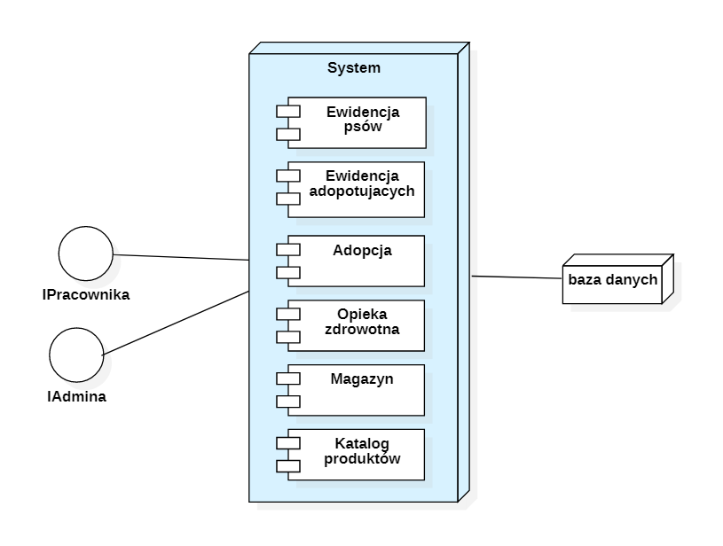
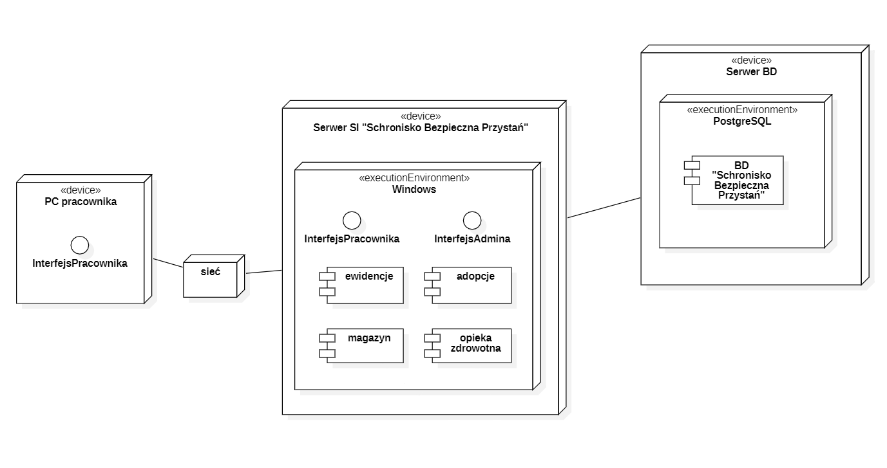

# Zadanie 10
## Diagram komponentów

## Diagram rozlokowania

## Inspekcja Fagana
**1.  Czy opis firmy/instytucji/środowiska, w którym będzie wykorzystywany przyszły system, jest zrozumiały i opisuje obecny sposób działania firmy/instytucji/środowiska?**

Tak, opis organizacji, w której będzie wykorzystywany przyszły system, jest napisany skrupulatnie i właściwie opisuje całokształt działania firmy.

**2.  Czy właściwie rozpoznano grupy użytkowników przy projektowaniu interfejsu? Czy są adekwatne aktorom z DPU? Na ile ich charakterystyka odzwierciedla ich kompetencje komputerowe oraz stopień przygotowania do użytkowania tworzonego systemu?**

Grupy zostały  rozpoznane prawidłowo i są adekwatne aktorom z DPU. Opis dokładnie określa kompetencje pracowników, system nie wymaga zbyt wielu dodatkowych lub zaawansowanych umiejętności, więc są przygotowani do użytkowania.

**3.  Czy poprawnie zostały rozpoznane i zdefiniowane typowe zadania dla tych grup? Na ile są one konkretne – tzn. zawierają konkretne dane? Czy obejmują rozwiązanie kilku problemów?**

Typowe zadania dla grup zostały rozpoznane oraz zdefiniowane poprawnie – obejmują one czynności, które będą najczęściej stosowane przez określoną grupę. Zadanie są jasne i klarowne, nie ma wątpliwości co do ich celu i rozwiązania. Obejmują one rozwiązanie kilku najważniejszych problemów, z którymi przyjdzie spotkać się przyszłym użytkownikom SI, natomiast rozwiązania nieujętych  zadań będą bardzo zbliżone do przedstawionych (ta sama/bardzo podobna logika rozwiązania).

**4.  Czy określony w DPU systemowym zakres przyszłego SI został ujęty w opisie (którego dotyczyło pytanie 1)?**

Tak, cały zakres SI został ujęty w opisie organizacji.

**5.  Na ile lista aktorów odpowiada przyjętemu zakresowi, jaki obejmie przyszły SI?**

Każdy aktor z listy jest przyporządkowany do co najmniej  dwóch PU. Wszyscy mają określony cel i wykonują założenia dziedziny problemowej.

**6.  Na ile diagram hierarchii funkcji (FHD) udostępnia potrzebne poszczególnym aktorom funkcjonalności? Co zostało pominięte?**

Diagram hierarchii funkcji udostępnia poszczególnym aktorom wszystkie niezbędne dla nich funkcjonalności, które będą im potrzebne do rozwiązywania powierzonych im zadań. Wygląda na to, że nic nie zostało pominięte.

**7.  Czy są odpowiadające tym zadaniom PU oraz funkcje – tzn. czy w systemie na poziomie DPU, FHD, scenariusze są przewidziane mechanizmy, które pozwolą na wykonanie stosownych operacji?**

Tak, każdy PU posiada scenariusz, w którym jest jasno określona jego funkcja i wszystkie mechanizmy pozwalające na wykonanie potrzebnych użytkownikom operacji.  Wszystkie funkcje i ich mechanizmy  przypisane danym PU zostały umieszczone na diagramie FHD.

**8.  Czy analiza projektów interfejsów została przeprowadzona wnikliwie?**

Analiza projektów interfejsów została przeprowadzona starannie, tak aby wykryć ewentualne niedociągnięcia i zakończyło się to sukcesem – pewne problemy zostały wykryte i pozwolą na poprawę projektu interfejsu.

**9.  Proszę przyporządkować funkcje z FHD do poszczególnych PU. Czy pozwolą one właściwie sterować poszczególnymi PU?**

|       PU                    |     Funkcje z FHD                                                                                                                                                                                             |
|-----------------------------|---------------------------------------------------------------------------------------------------------------------------------------------------------------------------------------------------------------|
|     Ewidencja psów          |   Rejestracja psa    Wyszukanie profilu psa (możliwe kolejne działania: podgląd, modyfikacja, usunięcie)   Lista wszystkich psów                                                                                 |
|     Ewidencja adoptujących  |   Rejestracja adoptującego   Wyszukanie profilu adoptującego (możliwe kolejne działania: podgląd, modyfikacja, usunięcie)   Lista wszystkich adoptujących                                                       |
|     Adopcja                 |   Dodanie nowego wpisu   Wyszukanie wpisu (możliwe kolejne działania: podgląd, modyfikacja, usunięcie)  Lista wszystkich wpisów                                                                               |
|     Opieka zdrowotna        |   Dodanie nowego wpisu do karty zdrowia   Wyszukanie wpisu w karcie zdrowia (możliwe kolejne działania: podgląd, modyfikacja, usunięcie)   Podgląd na kartę zdrowia psa (możliwe kolejne działanie: usunięcie)  |
|     Katalog produktów       |   Rejestracja produktu    Wyszukanie produktu (możliwe kolejne działania: podgląd, modyfikacja, usunięcie)   Lista wszystkich produktów                                                                         |
|     Magazyn                 |   Dodanie nowego wpisu do magazynu    Wyszukanie wpisu (możliwe kolejne działania: podgląd, modyfikacja, usunięcie)   Lista wszystkich wpisów w magazynie                                                       |             |
    

Funkcje z FHD wyczerpują wszystkie możliwości sterowania poszczególnymi przypadkami użycia.

**10.  Na ile poprawnie zostały zdefiniowane PU typu include oraz extend  – jeżeli wystąpiły, czy są potrzebne?**

Projekt nie posiada PU typu include  lub  extend.

**11.  Czy jasne jest jaki zakresy działań zostały przypisane poszczególnym PU? Czy scenariusze opisujące poszczególne PU odpowiadają tym zakresom?**

Tak, zakres funkcji  wszystkich PU został dokładnie opisany, a ich przebieg dokładnie przedstawiony w scenariuszach.

**12.  Czy w diagramie klas utworzone klasy obejmują cały zakres projektowanego SI – czy można utworzyć obiekty, które będą używane w trakcie wykonania poszczególnych (wszystkich) PU z DPU?**

Tak, klasy utworzone w diagramie klas obejmują cały zakres projektowanego SI i zostały przetestowane w formie diagramów obiektów dla wybranych sytuacji kontekstowych.

**13.  Czy jest adekwatność – diagram klas ↔ schemat BD?**

Tak, wszystkie klasy i związki występujące w diagramie klas zostały przedstawione na relacyjnym modelu bazy danych.

**14.  Czy są metody odpowiadające funkcjom w FHD?**

Tak, są metody odpowiadające funkcjom w FHD.

**15.  Czy każda porcja informacji zawarta w diagramie związków encji podlega zasadzie CRUD – tzn. czy może być utworzona (wpisana), czytana, edytowana, usuwana?**

Tak, wszystkie porcje informacji zawarte w diagramie związków encji są typu CRUD.

**16.  Czy da się ustalić dla wszystkich porcji informacji zawartych w encjach odpowiednie sekwencje: funkcja > PU > atrybut (-y) encji?**

Tak, we wszystkich porcjach informacji zawartych w encjach da się ustalić odpowiednie sekwencje. PU oraz funkcje posiadają takie same nazwy, a wszystkie atrybuty występujące na diagramie związków encji zostały tak samo nazwane w diagramie klas.

**17.  Czy są funkcje oraz PU, które spowodują wykonanie operacji CRUD na tych atrybutach?**

Tak, w systemie istnieją funkcje oraz PU które powodują wykonanie operacji CRUD na tych wszystkich przypisanych im atrybutach.

**18.  Którzy aktorzy z jakiej informacji w BD mogą skorzystać i za pomocą jakich funkcji –sekwencje: aktor > funkcja > atrybut(-y) encji?**

|       Aktor             |     Funkcja                                                                                   |     Encja                                                     |
|-------------------------|-----------------------------------------------------------------------------------------------|---------------------------------------------------------------|
|     Pracownik biurowy   |   Ewidencja psów (CRUD)   Ewidencja adoptujących (CRUD)   Adopcja (CRUD)   Opieka zdrowotna (R)  |   Pies   Adoptujący   Adopcja   Karta zdrowia, Środek leczniczy  |
|     Weterynarz          |   Ewidencja psów (RU)   Opieka zdrowotna (CRUD)                                                |   Pies   Karta zdrowia, Środek leczniczy                       |
|     Behawiorysta        |   Ewidencja psów (R)   Opieka zdrowotna (CRUD)                                                 |   Pies   Karta zdrowia, Środek leczniczy                       |
|     Kierownik magazynu  |   Katalog produktów (CRUD)   Magazyn (CRUD)                                                    |   Produkt   Magazyn                                            |
|     Magazynier          |   Katalog produktów (R)   Magazyn (CRUD)                                                       |   Produkt   Magazyn                                            |

**19.  Czy wszystkie istotne pojęcia funkcjonujące w projekcie zostały ujęte w słowniku?**

Tak, udało nam się ująć wszystkie istotne dla projektu  pojęcia w słowniku.

**20.  Czy diagramy wdrożeniowe ujęły zakres DPU przewidziany do implementacji wariantu 1.0?**
    
Tak, diagramy wdrożeniowe ujęły cały zakres DPU przewidziany do implementacji wariantu 1.0.
