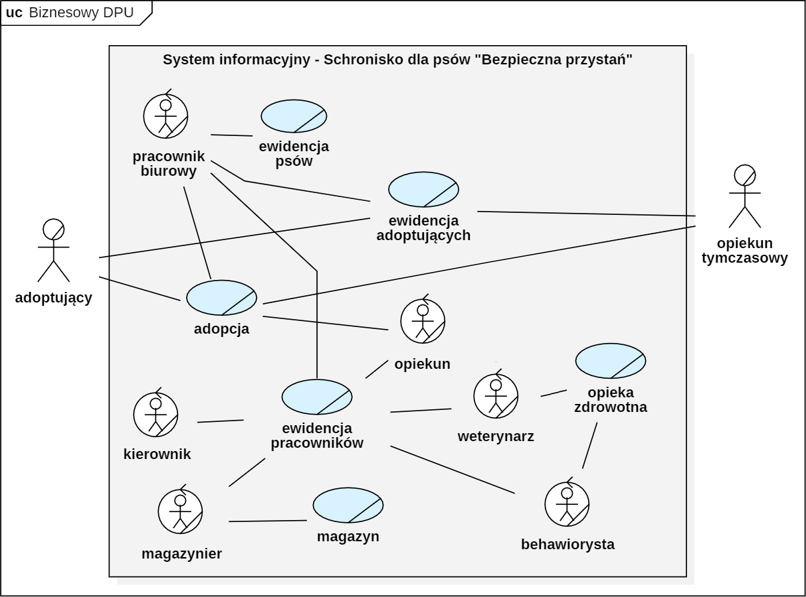

# Zadanie 2
### Zakres organizacji:
- Opiekowanie  się psami potrzebującymi pomoc
- Umieszczanie ogłoszeń adopcyjnych w Internecie by znaleźć nowy dom dla psów w schronisku
- Prowadzenie ewidencji psów z podziałem na grupy (psy przyjęte do schroniska, psy na kwarantannie, psy do adopcji, psy w domach tymczasowych, psy zaadoptowane)
- Prowadzenie ewidencji adoptujących i opiekunów tymczasowych
- Dokumentowanie procesu adopcyjnego
- Leczenie i wykonywanie usług weterynaryjnych, przeprowadzanie szkoleń i terapii behawioralnych  oraz rejestrowanie tych czynności
- Rejestrowanie posiadanych karm oraz środków leczniczych
- Prowadzenie ewidencji zawierającej dane pracowników
- Uczestniczenie w zbiórkach karmy i innych artykułów pierwszej potrzeby
- Promowanie idei adopcji zwierząt ze schroniska
- Edukowanie innych w zakresie prawidłowej opieki nad zwierzętami
    

### Dziedzina problemowa:
- Ewidencja psów z podziałem na grupy (psy przyjęte do schroniska, psy na kwarantannie, psy do adopcji, psy w domach tymczasowych, psy zaadoptowane)
- Ewidencja adoptujących i opiekunów tymczasowych
- Dokumentacja procesu adopcyjnego
- Rejestr usług weterynaryjnych, leczenia, szkoleń, terapii behawioralnych
- Rejestr aktualnie posiadanych karm oraz środków leczniczych
- Ewidencja pracowników

### Aktorzy biznesowi:
- Adoptujący
- Opiekun tymczasowy

### Pracownicy biznesowi:
- Kierownik = kierownik / zastępca kierownika
- Pracownik biurowy
- Opiekun
- Weterynarz – lekarz weterynarii / technik weterynarii
- Behawiorysta
- Magazynier = kierownik magazynu / magazynier

### Biznesowe przypadki użycia:
- Ewidencja psów
- Ewidencja adoptujących
- Adopcja
- Opieka zdrowotna
- Magazyn
- Ewidencja pracowników

### Biznesowy DPU:

### Scenariusze biznesowe:
**PU “ewidencja psów”:**

Dodanie nowego psa do ewidencji:
1.  Do schroniska przybywa nowy pies
2.  Pracownik biurowy zbiera wszystkie informacje na temat psa
3.  Pracownik biurowy zapisuje wszystkie dane na temat psa w ewidencji schroniska

Aktualizacja danych na temat psa:
1.  Pracownik biurowy wyszukuje danego psa w ewidencji schroniska
2.  Pracownik biurowy zmienia lub dodaje informacje o psie w ewidencji schroniska

Wykreślenie psa z ewidencji:
1.  Pracownik biurowy wyszukuje danego psa w ewidencji schroniska
2.  Pracownik biurowy wykreśla psa z ewidencji schroniska
 

#### PU “ewidencja adoptujących”:

Dodanie nowego opiekuna tymczasowego do ewidencji:
1.  Opiekun tymczasowy informuje schronisko o chęci stworzenia domu tymczasowego
2.  Pracownik biurowy przeprowadza wywiad z potencjalnym opiekunem tymczasowym
3.  Opiekun tymczasowy podaje stosowne informacje
4.  Pracownik biurowy decyduje czy opiekun tymczasowy ma możliwość stworzenia odpowiedniego domu tymczasowego – decyzja jest pozytywna
5.  Pracownik biurowy pyta o dane opiekuna tymczasowego
6.  Opiekun tymczasowy podaje swoje dane
7.  Pracownik biurowy wpisuje dane opiekuna na listę domów tymczasowych
8.  Pracownik biurowy kończy spotkanie z opiekunem tymczasowym

*Alternatywnie w sytuacji decyzji negatywnej:* 
Pracownik biurowy decyduje czy opiekun tymczasowy ma możliwość stworzenia odpowiedniego domu tymczasowego – decyzja jest negatywna. Pracownik biurowy kończy spotkanie z opiekunem tymczasowym.
    
Aktualizacja danych na temat opiekuna tymczasowego:
1.  Pracownik biurowy wyszukuje na liście dany dom tymczasowy
2.  Pracownik biurowy zmienia dane lub dodaje informacje o domie tymczasowym
  
Wykreślenie  opiekuna tymczasowego: z listy:
1.  Pracownik biurowy wyszukuje na liście dany dom tymczasowy
2.  Pracownik biurowy wykreśla dom tymczasowy z listy
 

Dodanie adoptującego do ewidencji:
1.  Adoptujący informuje schronisko o chęci adopcji psa
2.  Pracownik biurowy ustala z adoptującym datę wizyty w schroniska
3.  Po przybyciu do schroniska opiekun przedstawia psa adoptującemu i przekazuje mu dodatkowe informacje o psie
4.  Po odbyciu wszystkich koniecznych wizyt w schronisku adoptujący nadal wyraża chęć adopcji psa
5.  Pracownik biurowy decyduje czy adoptujący jest odpowiedni dla wybranego psa – decyzja jest pozytywna
6.  Pracownik biurowy kontaktuje się z adoptującym i pyta o jego szczegółowe dane
7.  Adoptujący podaje swoje dane
8.  Pracownik biurowy wpisuje dane adoptującego do ewidencji schroniska
9.  Pracownik biurowy kończy rozmowę z adoptującym

*Alternatywnie w sytuacji decyzji negatywnej:* 
Pracownik biurowy decyduje czy adoptujący jest odpowiedni dla wybranego psa – decyzja jest negatywna. Pracownik biurowy kończy rozmowę z adoptującym.

Aktualizacja danych na temat adoptującego:
1.  Pracownik biurowy wyszukuje w ewidencji adoptującego
2.  Pracownik biurowy zmienia dane lub dodaje informacje o adoptującym

Wykreślenie adoptującego z ewidencji:
1.  Pracownik biurowy wyszukuje w ewidencji adoptującego
2.  Pracownik biurowy wykreśla adoptującego z ewidencji schroniska
 

#### PU “adopcja”:

Rozpoczęcie procesu adopcyjnego:
1.  Adoptujący przegląda ogłoszenia psów gotowych do adopcji na stronie internetowej schroniska bądź udaje się bezpośrednio do schroniska
2.  Adoptujący kontaktuje się z schroniskiem by poinformować o chęci adopcji psa
3.  Pracownik biurowy pyta o to, jaki pies go interesuje
4.  Adoptujący podaje stosowne informacje
5.  Pracownik biurowy umawia się z adoptującym na wizytę w schronisku
6.  Adoptujący udaje się do schroniska na obowiązkowe wizyty przed-adopcyjne
7.  Adoptujący po wizytach dalej wyraża chęć adopcji
8.  Pracownik biurowy na podstawie posiadanych informacji kontaktuję się z adoptującym by przekazać informację o kontynuowaniu bądź przerwaniu procesu adopcyjnego – decyzja jest pozytywna
9.  Pracownik biurowy ustala z adoptującym odpowiedni dzień na podpisanie umowy i odbiór psa
10.  Pracownik biurowy tworzy książeczkę zdrowia psa i wpisuje do niej najważniejsze informacje dotyczące psa (ostatnie szczepienia, odpchlenia, odrobaczenia, poważne operacje, choroby, alergie)
11.  Adoptujący stawia się w schronisku i następuje finalizacja adopcji – podpisanie umowy i odbiór psa wraz z jego książeczką zdrowia
12.  Pracownik biurowy zapisuje informacje dotyczące adopcji do rejestru adopcji

*Alternatywnie w sytuacji decyzji negatywnej:* 
Pracownik biurowy na podstawie posiadanych informacji kontaktuję się z adoptującym by przekazać informację o kontynuowaniu bądź przerwaniu procesu adopcyjnego – decyzja jest negatywna. Pracownik przerywa proces adopcyjny.
    
Aktualizacja danych na temat adopcji:
1.  Pracownik biurowy wyszukuje daną adopcję w rejestrze schroniska
2.  Pracownik biurowy zmienia lub dodaje informacje o adopcji w rejestrze schroniska

Wykreślenie adopcji z rejestru schroniska:
1.  Pracownik biurowy wyszukuje daną adopcję w rejestrze schroniska
2.  Pracownik biurowy wykreśla adopcję z rejestru schroniska
 

#### PU “opieka zdrowotna”:

Potrzeba przeprowadzenia badań lub zabiegów:
1.  Weterynarz udaje się po psa do wyznaczonego kojca
2.  Weterynarz przenosi psa do szpitala schroniskowego
3.  Przeprowadzenie badania bądź wykonanie zabiegu na psie
4.  Rejestracja wykonanych badań i zabiegów w karcie zdrowia psa
5.  Przeniesienie psa z powrotem do kojca

Potrzeba przeprowadzenia szkolenia lub terapii:
1.  Behawiorysta udaje się po psa do wyznaczonego kojca
2.  Behawiorysta przenosi psa do salki treningowej
3.  Behawiorysta przeprowadza szkolenie lub ewentualną terapie
4.  Rejestracja wykonanego szkolenia lub terapii w karcie zdrowia psa
5.  Przeniesienie psa z powrotem do kojca

Aktualizacja informacji w karcie zdrowia:
1.  Pracownik wyszukuje daną kartę zdrowia
2.  Pracownik zmienia lub dodaje informacje do karty zdrowia

Zniszczenie karty zdrowia:
1.  Pracownik wyszukuje daną kartę zdrowia
2.  Pracownik niszczy kartę zdrowia
 

#### PU ”magazyn”:

Przybycie nowego towaru:
1.  Magazynier dostaje informacje o przybyciu transportu z zaopatrzeniem
2.  Magazynier odbiera i rozpakowuje towar
3.  Magazynier przenosi i układa w towar w magazynie na odpowiednich miejscach
4.  Magazynier zapisuje w rejestrze magazynu dokładną ilość i rodzaj towaru jaki przybył do schroniska

Aktualizacja danych na temat towaru:
1.  Magazynier wyszukuje odpowiedni towar w rejestrze magazynu
2.  Magazynier zmienia lub dodaje nowe dane o towarze znajdującym się magazynie

Wykreślenie towaru z rejestru:
1.  Magazynier wyszukuje odpowiedni towar w rejestrze magazynu
2.  Magazynier usuwa dany towar z rejestru magazynu
 

#### PU ”ewidencja pracowników”:

Zatrudnienie nowego pracownika: 
5 kwietnia 2022 r. do schroniska został zatrudniony nowy lekarz weterynarii Jan Kowalski. Po podpisaniu umowy kierownik  Agata Szpak prosi nowego pracownika o podanie swoich danych osobowych jak pełne imię i nazwisko, adres, numer telefonu oraz adres e-mail. Jan Kowalski po kolei podaje swoje dane. Kierownik zapisuje informacje o pracowniku do jego karty pracownika. Kierownik potwierdza poprawność wpisanych danych, a następnie żegna się z pracownikiem.

Aktualizacja danych na temat pracownika: 
Opiekunka Katarzyna Kwarc zmieniła miejsce swojego zamieszkania i powiadomiła o tym zastępcę kierownika schroniska  Mariusza Wierzbę. Zastępca kierownika umówił się z nią na spotkanie by zaktualizować jej kartę pracownika. Po przywitaniu się z pracownikiem zastępca kierownika wyszukuje kartę pracownika w ewidencji pracowników i prosi Katarzynę Kwarc o podanie jej nowego adresu. Opiekuna podaje swój aktualny adres zamieszkania. Zastępca kierownika aktualizuje dane osobowe pracownika, a następnie żegna się z pracownikiem.

Zniszczenie danych na temat pracownika: 
Kierownik Agata Szpak postanowiła uporządkować ewidencję pracowników i zniszczyć karty pracowników, którzy przestali pracować w schronisku ponad 10 lat temu. Agata Szpak wyjmuje kartę pracownika Anny Kowalskiej i wkłada ją do niszczarki papierów.
