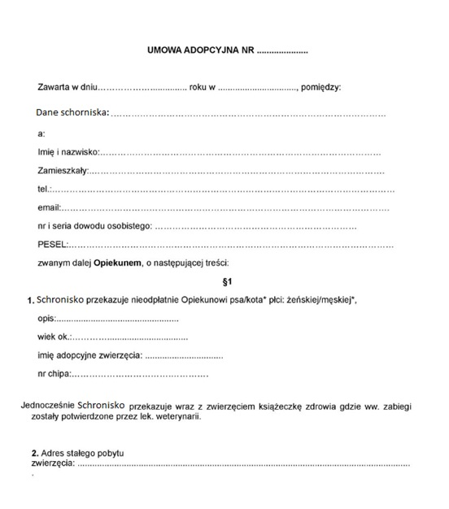
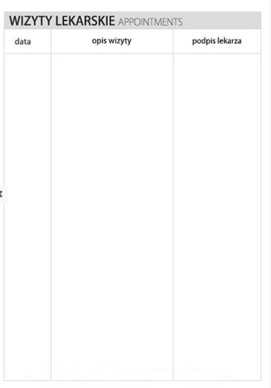

# Zadanie 3
## Analiza dokumentów występujących w ramach dziedziny problemowej
### Umowa adopcyjna
  
umowa_adopcyjna = kiedy_zawarta + dane_schroniska + dane_opiekunaa+ dane_zwierzęcia  + adres_stałego_pobytu_zwierzęcia  
kiedy_zawarta = dzien + rok + gdzie_zawarta  
dane_opiekuna = imie, nazwisko + adres + tel + email + nr_i_seria  _dowodu_osobistego + pesel  
dane_zwierzęcia = (opis) + wiek + imie + nr_chipa + płeć

### Książeczka zdrowia psa
  
ksiazeczka_zdrowia_psa = dane_zwierzęcia + (właściciel) + {pasożyty} + {wizyty_lekarskie} + {szczepienia}  
dane_zwierzęcia = imię + rasa + data_urodzenia + płeć + maść + nr_identyfikacyjny + (znaki_szczególne) + (zdjęcie)  
właściciel = imię + nazwisko + adres + numer_telefonu + (adres_email)    
  
pasożyty = data + {rodzaj} + {preparat} + pieczątka + podpis_lekarza  
rodzaj = [ p. wewnętrzne | pchły | kleszcze ]    
  
wizyty_lekarskie = data + opis_wizyty + podpis_lekarza    
  
szczepienia = data + {preparat} + pieczątka, podpis_lekarza

### Karta ewidencyjna zwierzęcia
  
karta_ewidencyjna_zwierzęcia = nr_ewidencji + nazwa_zwierzęcia + płeć + rasa + nr_chipa + data_ur  + waga + nr_boksu + znaki_szczególne + (opis_zwierzęcia) +  nr_książeczki _zdrowia + adnotacje_przyjęcia_zwierzęcia  
adnotacje_przyjęcia_zwierzęcia = data_przyjęcia + (uwagi)

### Dokument przyjęcia z zewnątrz
  
dokument_pz = data_przyjęcia + nr_dokumentu + odbiorca + dostawca + towar + wydał_podpis + odebrał_podpis  
odbiorca = nazwa + adres + nip  
dostawca = nazwa + adres + nip  
towar = nazwa + ilość + jednostka + cena + wartość
