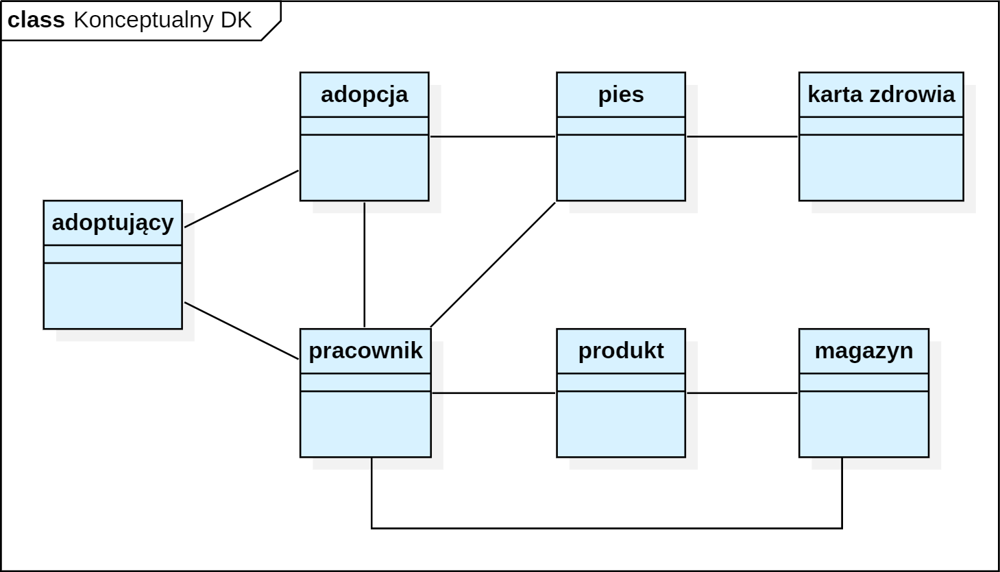

# Zadanie 4
## Klasy
- pies – dotycząca PU “ewidencja psów”  
Atrybuty: nr_ewidencji, data_przyjęcia, imię, płeć, data_urodzenia, wiek, waga, rasa, nr_czipa, status (przyjęty, kwarantanna, do adopcji, dom tymczasowy, zaadaptowany, zmarły), nr_boksu  , alergie, choroby, zdjęcie, opis
- adoptujący – dotycząca PU “ewidencja adoptujących”  
Atrybuty: id_adoptującego, imię, nazwisko, adres, nr_dowodu, email, nr_tel, typ (stały, tymczasowy), uwagi
- adopcja – dotycząca PU “adopcja”  
- Atrybuty: id_adopcji, data, status (rozpoczęta, przerwana, zakończona), typ (stała, tymczasowa), uwagi
- karta zdrowia  – dotycząca PU “opieka zdrowotna”  
Atrybuty: nr_wpisu, usługa, data, środki_lecznicze, rodzaj (weterynaryjna, behawioralna, inna), uwagi
- produkt – dotycząca PU “katalog produktów”  
Atrybuty: id_produktu, nazwa, producent, pojemność, waga, rodzaj, kategoria (karma, środek leczniczy)
- magazyn – dotycząca PU “magazyn”  
Atrybuty: nr_wpisu, data_przybycia, data_ważności, ilość
- pracownik – dotyczy PU “ewidencja pracowników”  
Atrybuty: id_pracownika, hasło, data_logowania, imię, nazwisko, adres, nr_dowodu, email, nr_tel , stanowisko, data_zatrudnienia

### Diagram konceptualny

## Związki
### Ewidencja psów
#### Pracownik -> Pies
- Nazwa: ewidencja psów
- Typ: asocjacja
- Liczebność: 1-wiele
- Role: pracownik – zarządza profilem psa, pies – jest zarządzany
- Nawigacja: jednostronna od pracownika do psa
 

### Ewidencja adoptujących
#### Pracownik -> Adoptujący
- Nazwa: ewidencja adoptujących
- Typ: asocjacja 
- Liczebność: 1-wiele 
- Role: pracownik – zarządza profilem adoptującego, adoptujący – jest zarządzany 
- Nawigacja: jednostronna od pracownika do adoptującego
 

### Adopcja
#### Adoptujący -> Pies
- Nazwa: adopcja
- Typ: asocjacja
- Liczebność: wiele-wiele
- Role: adoptujący – adoptuje psa, pies – jest adoptowany, adopcja – dotyczy danych adopcji
- Nawigacja: dwustronna pomiędzy adoptującym a psem (klasa asocjacyjna “adopcja”)
    

#### Pracownik -> Adopcja
- Nazwa: adopcja
- Typ: asocjacja
- Liczebność: 1-wiele
- Role: pracownik – zarządza adopcją, adopcja – jest zarządzana
- Nawigacja: jednostronna od pracownika do adopcji
 

### Karta zdrowia
#### Karta zdrowia -> Pies
- Nazwa: karta zdrowia
- Typ: agregacja całkowita 
- Liczebność: 1-wiele
- Role: karta zdrowia – jest częścią profilu psa, pies – posiada kartę zdrowia
- Nawigacja: jednostronna od karty zdrowia do psa
 

### Magazyn
#### Pracownik -> Magazyn
- Nazwa: magazyn
- Typ: asocjacja 
- Liczebność: 1-wiele 
- Role: pracownik – zarządza magazynem, magazyn – jest zarządzany
- Nawigacja: jednostronna od pracownika do magazynu
    
#### Produkt <-> Magazyn
- Nazwa: magazyn
- Typ: asocjacja
- Liczebność: 1-wiele
- Role: magazyn – posiada produkt, produkt – jest posiadany przez magazyn
- Nawigacja: dwustronna
 

### Katalog produktów
#### Pracownik -> Produkt
- Nazwa: katalog produktów 
- Typ: asocjacja 
- Liczebność: 1-wiele
- Role: pracownik – zarządza produktem, produkt – jest zarządzany 
- Nawigacja: jednostronna od pracownika do produktu

