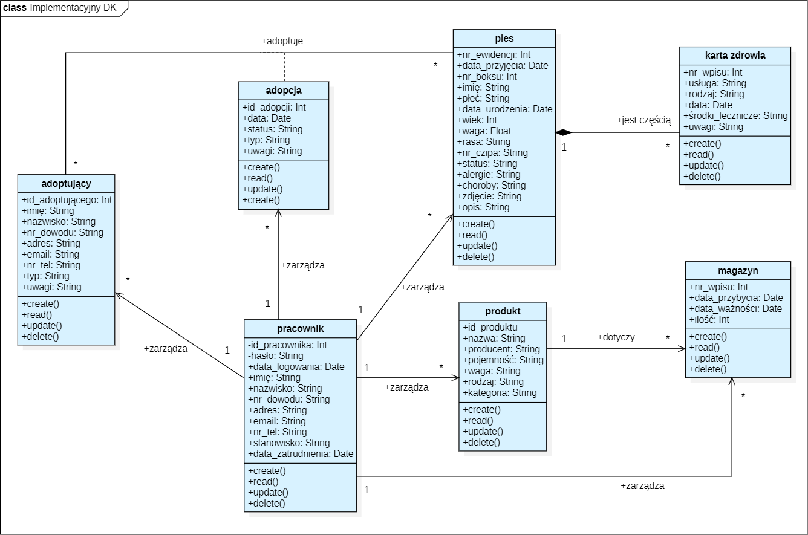
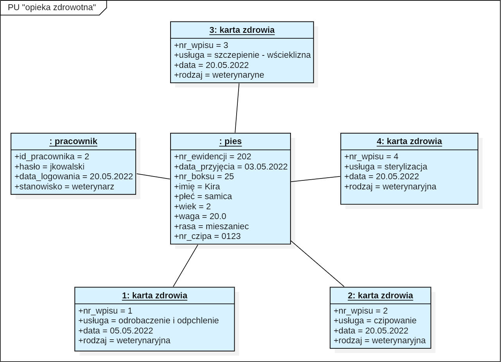
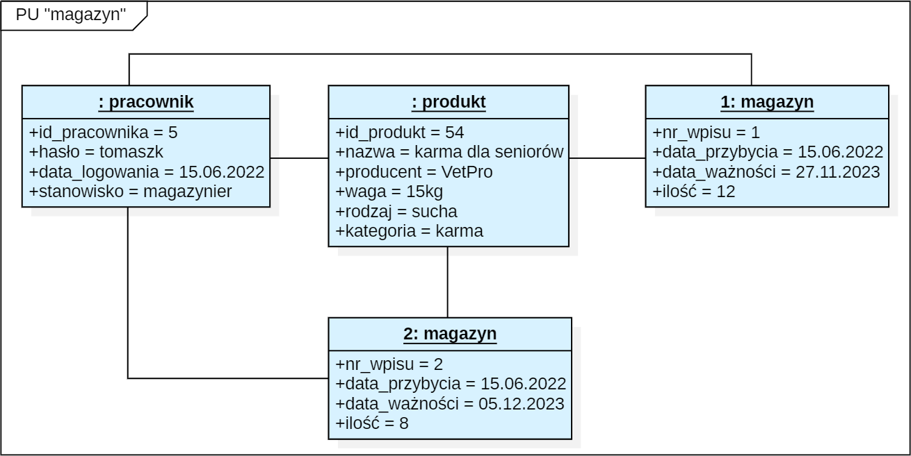
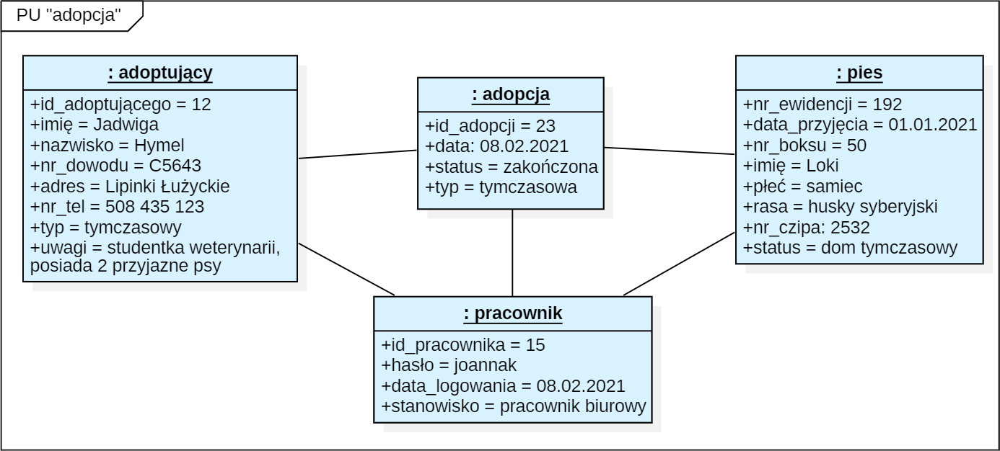

# Zadanie 5
## Implementacyjny diagram klas

## Diagramy obiektów
### Sytuacja dotycząca PU “opieka zdrowotna”
**Opis:** 3 maja 2022 r. do schroniska trafiła suczka o imieniu Kira, której został nadany numer ewidencyjny 202 i została umieszczona w boksie nr 25. Nie posiadała na sobie czipa.  Weterynarz badający Kirę określił, że jest rasy mieszaniec, ma ok. 2 lata i waży 20kg. 5 maja 2022 r., podczas 2 tygodniowej kwarantanny, Kira została odrobaczona i odpchlona. Po rozesłaniu informacji o odnalezionym zwierzęciu do lokalnej prasy i mediów, jego właściciel, ani nikt kto posiada jakiekolwiek informacje o psie, nie zgłosił się. W celu przygotowania Kiry do adopcji, szczepienie na wściekliznę, czipowanie i sterylizacja suczki, zostały zaplanowane na 20 maja 2020 r. Po wykonaniu zabiegów weterynarz Jan Kowalski (id pracownika: 2, hasło: jkowalski) rejestruje wykonane czynności w karcie zdrowia zwierzęcia oraz dodaje numer czipa (0123) do profilu Kiry w ewidencji schroniska. Po wszystkich czynnościach weterynarz wylogowuje się z systemu.

**Przebieg sytuacji:**
1.  Weterynarz loguje się do systemu – powstaje obiekt klasy “pracownik”
2.  Weterynarz wybiera w interfejsie ewidencję w celu wyszukania profilu Kiry – powstaje obiekt klasy “pies”
3.  Weterynarz wyszukuje Kirę po jej numerze ewidencyjnym (metoda R klasy “pies”) – obiekt klasy “pies” jest aktualizowany o nr_ewidencji
4.  Weterynarz znajduje i wyświetla profil Kiry – obiekt klasy “pies” jest aktualizowany o dane Kiry
5.  Weterynarz uzupełnia profil psa o numer czipa (metoda U klasy “pies”) – obiekt klasy “pies” jest aktualizowany
6.  Weterynarz wybiera kartę zdrowia psa (metoda R klasy “karta zdrowia” – powstają obiekty klasy “karta zdrowia”
7.  Weterynarz uzupełnia kartę zdrowia o wykonane usługi (metoda C klasy “karta zdrowia”) – powstają nowe obiekty klasy “karta zdrowia”
8.  Weterynarz wylogowuje się z systemu – wszystkie obiekty zostają usunięte

### Sytuacja dotycząca PU “magazyn”
**Opis:** Do schroniska 15 czerwca 2022 przybyła nowa dostawa suchej karmy dla seniorów firmy VetPro. Schronisko zamówiło tę karmę po raz pierwszy, więc nie ma jej jeszcze w bazie schroniska. Po sprawdzeniu dat ważności każdego opakowania, magazynier Tomasz Kot (id pracownika: 5, hasło: tomaszk) dowiedział się, że 12 opakowań ma datę ważności 27 listopada 2023 r., a pozostałe 8 opakowań 5 grudnia 2023 r. Magazynier rozpakował wszystkie opakowania 15kg karmy i odpowiednio ułożył je w magazynie, a następnie dodał ją do bazy schroniska z id produktu 54. Po dodaniu produktu magazynier utworzył wpis o jej ilości i dacie ważności do magazynu.

**Przebieg sytuacji:**
1.  Magazynier loguje się do systemu – powstaje obiekt klasy “pracownik”
2.  Magazynier wybiera z interfejsu opcję dodania nowego produktu do systemu i uzupełnia o nim potrzebne informacje (metoda C klasy “produkt”) – powstaje nowy obiekt klasy “produkt”
3.  Magazynier wyświetla dane nowo utworzonego produktu (metoda R klasy “produkt” – obiekt klasy “produkt” jest aktualizowany o wprowadzone dane
4.  Magazynier wybiera opcję dodania pierwszego wpisu do magazynu (metoda C klasy “magazyn”) – powstaje nowy obiekt klasy “magazyn”
5.  Magazynier wprowadza dane dotyczące produktu – obiekt klasy “magazyn” jest aktualizowany
6.  Magazynier wybiera opcję dodania drugiego wpisu do magazynu (metoda C klasy “magazyn”) – powstaje nowy obiekt klasy “magazyn”
7.  Magazynier wprowadza dane dotyczące produktu – obiekt klasy “magazyn” jest aktualizowany

### Sytuacja dotycząca PU “adopcja”

**Opis:** W schronisku znajduje się pies rasy husky syberyjski o imieniu Loki (nr ewidencji: 192, data przyjęcia: 1 stycznia 2021, nr boksu 50, nr czipa: 2532), który tydzień temu przeszedł poważną operację ratującą jego życie. Czas powrotu do zdrowia w jego sytuacji waha się od 1 do 2 miesięcy. Pracownicy schroniska chcą by Loki doszedł do siebie w domowych warunkach, gdzie zostanie potraktowany indywidualnie i otoczony opieką. Opatrunki psa wymagają zmiany co kilka godzin, dlatego pracownicy zwrócili na to uwagę przy szukaniu odpowiedniego opiekuna tymczasowego. Jadwiga Hymel (id adoptującego 12, nr dowodu C5643,  nr telefonu: 508 435 123) jest studentką V roku weterynarii mieszkającą w Lipinkach Łużyckich. 5 lutego 2021 r., po skontaktowaniu się z kobietą, pracownik biurowy Joanna Kłos (id pracownika: 15, hasło: joannak) otrzymała pozytywną decyzję o chęci adopcji tymczasowej i rozpoczęła proces adopcyjny nadając adopcji id 23. 3 dni po rozmowie Jadwiga Hymel odwiedziła schronisko w celu sfinalizowania adopcji i odebrania psa. Pracownik biurowy wprowadza informacje o zakończonym procesie adopcyjnym do systemu.

**Przebieg sytuacji:**
1.  Pracownik biurowy loguje się do systemu – powstaje obiekt klasy “pracownik”
2.  Pracownik biurowy wybiera opcję dodania nowego wpisu dotyczącego adopcji (metoda C klasy “adopcja”) – powstaje nowy obiekt klasy adopcja
3.  Pracownik biurowy wpisuje dane dotyczące adopcji – obiekt klasy “adopcja” jest aktualizowany
4.  Pracownik biurowy wybiera psa (metoda R klasy “pies”) – powstaje obiekt klasy “pies”
5.  Pracownik biurowy wybiera adoptującego (metoda R klasy “adoptujący”) – powstaje obiekt klasy “adoptujący”

