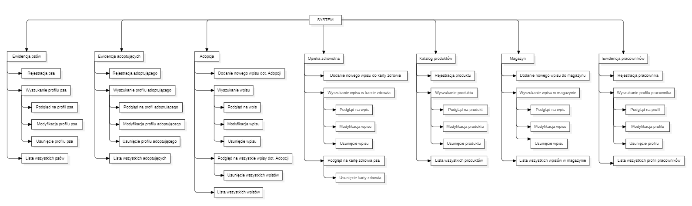

# Zadanie 6
## Lista funkcji

### Ewidencja psów
-   Rejestracja psa
-   Wyszukanie profilu psa
-   Podgląd na profil psa
-   Modyfikacja profilu psa
-   Usunięcie profilu psa
-   Lista wszystkich profili psów z podziałem na grupy  
    

### Ewidencja adoptujących
-   Rejestracja adoptującego
-   Wyszukanie profilu adoptującego
-   Podgląd na profil adoptującego
-   Modyfikacja profilu adoptującego
-   Usunięcie profilu adoptującego
-   Lista wszystkich profili adoptujących  z podziałem na typ
    

### Adopcja
-   Dodanie nowego wpisu dot. adopcji
-   Wyszukanie wpisu dot. adopcji
-   Podgląd na wpis dot. adopcji
-   Podgląd na wszystkie wpisy dot. wybranej adopcji
-   Modyfikacja wpisu dot. adopcji
-   Usunięcie wpisu dot. adopcji
-   Usunięcie wszystkich wpisów dot. wybranej adopcji
-   Lista wszystkich wpisów dot. adopcji z podziałem na status
    

### Opieka zdrowotna
-   Dodanie nowego wpisu do karty zdrowia
-   Wyszukanie wpisu w karcie zdrowia
-   Podgląd na wpis w karcie zdrowia
-   Modyfikacja wpisu w karcie zdrowia
-   Usunięcie wpisu w karcie zdrowia
-   Podgląd na kartę zdrowia psa  z podziałem na rodzaj usługi
-   Usunięcie karty zdrowia psa  
    

### Katalog produktów
-   Rejestracja produktu
-   Wyszukanie produktu
-   Podgląd na produkt
-   Modyfikacja produktu
-   Usunięcie produktu
-   Lista wszystkich produktów
    

### Magazyn
-   Dodanie nowego wpisu do magazynu
-   Wyszukanie wpisu w magazynie
-   Podgląd na wpis w magazynie
-   Modyfikacja wpisu w magazynie
-   Usunięcie wpisu w magazynie
-   Lista wszystkich wpisów w magazynie
    

### Ewidencja pracowników
-   Rejestracja pracownika
-   Wyszukanie profilu pracownika
-   Podgląd na profil pracownika
-   Modyfikacja profilu pracownika
-   Usunięcie profilu pracownika
-   Lista wszystkich profili pracowników
    

## Diagram FHD

## Grupy użytkowników i ich charakterystyka
|       Użytkownik        |     Zadanie                                                                                   |
|-------------------------|-----------------------------------------------------------------------------------------------|
|     Kierownik           |   Ewidencja pracowników (CRUD)                                                                |
|     Pracownik biurowy   |   Ewidencja psów (CRUD)    Ewidencja adoptujących (CRUD)   Adopcja (CRUD)   Opieka zdrowotna (R\)  |
|     Weterynarz          |   Ewidencja psów (RU)   Opieka zdrowotna (CRUD)                                          |
|     Behawiorysta        |   Ewidencja psów (R\)   Opieka zdrowotna (CRUD)                                          |
|     Kierownik magazynu  |   Katalog produktów (CRUD)   Magazyn (CRUD)                                              |
|     Magazynier          |   Katalog produktów (R\)   Magazyn (CRUD)                                                |

## Wymagania względem interfejsu i kryteria oceny
|       Kryteria     |       Charakterystyka użytkowników                                    |     Wymagania do interfejsu  |
|---------------------------------------|----------------------------------------------------|------------------------------|
|     Wiek                              |   18 - 65                                          |   Prosty w obsłudze          |
|     Wykształcenie                     |   Wykształcenie zawodowe, średnie lub wyższe       |   Przyswajalny               |
|     Prywatność użytkownika            |   Mało ważna, dużo ważna                           |   Bezpieczny                 |
|     Zdolności manualne                |   Widzący, sprawny manualnie                       |                              |
|     Częstość użycia                   |   Rzadko-często                                    |   Stabilny                   |
|     Wygoda użytkowania                |   Umiarkowana, duża                                |   Intuicyjny                 |
|     Zadania do wykonania użytkownika  |   Mało-dużo (liczba zadań), mono/poli tematyczne   |   Funkcjonalny               |

## Normy jakości

-   ### Prosty w obsłudze:
    
Nieskomplikowany,  niezagmatwany – tak aby użytkownik  mało zaawansowany mógł  z  łatwością go obsłużyć

**Metryka:**

4 potencjalnych użytkowników wykonuje po 3 zadania

**Miara:**

Ankieta  opisowa – testujący oceniają działanie poprzez plusy (co było proste) i minusy (co było zagmatwane, niezrozumiałe). Inna osoba analizuje ankietę i daje jakościową ocenę.
   
-   ### Przyswajalny:
    

Przejrzysty, obsługi można szybko się nauczyć, nawigacja jest prosta i intuicyjna

**Metryka:**

4 nowych użytkowników dostaje zadanie do wykonania

**Miara:**

W skali punktowej 1  -  20 - w zależności od czasu wykonania zadania i napotkanych problemów:

1 problem => -  2pkt

**Skala czasowa:**

<5min => max, czyli 20pkt

Każde +1m => -1pkt

**Wyniki:**

-   15 – 20 pkt => Interfejs bardzo dobrze przyswajalny
    
-   8 - 14 pkt => Interfejs jest przyswajalny, ale trzeba popracować nad jego uproszczeniem i ewentualnymi problemami
    
-   0 - 7 pkt => Interfejs nie jest  łatwy do nauki, konieczne jest ułatwienie i zwiększenie wygody korzystania
-   
       
-   ### Intuicyjny
    

Czytelny i estetyczny, elementy są dobrze widoczne i zrozumiałe, układ jest zorganizowany, rozmieszczenie elementów nie jest przypadkowe, a obsługa jest wygodna.

**Metryka:**

3 użytkowników dostaje zadanie wskazanie  5 różnych elementów/funkcji SI

**Miara:**

W skali punktowej 1-10 - w zależności od ilości znalezionych elementów w czasie 5min.

(1 element => +2pkt)

**Wyniki:**

-   10 pkt => Wzorowa intuicyjność
    
-   6 - 8  pkt => Dobra intuicyjność, ale trzeba zastanowić się nad jej polepszeniem
    
-   0 - 4 pkt => Słaba intuicyjność, należy poprawić czytelność i organizację interfejsu
    
   
-   ### Stabilny
    

Awarie (zawieszenia, zacinanie, crashowanie) są rzadkie, jest wytrzymały

**Metryka:**

5 wyznaczonych użytkowników w trakcie miesiąca rejestruje każdą awarię

**Miara:**

Ilościowa - w skali 1-100  pkt - w zależności od liczby błędów/awarii

< 0 awarii => 100 pkt

Każda +1 awaria => -  2  pkt  *  waga

**Waga:**

-   ‘1’ dla niewielkiej awarii, która była chwilowa lub/i ledwie dostrzegalna i nie wpłynęła znacząco na korzystanie z SI
    
-   ‘3’ dla awarii, która trwała dłużej i zakłóciła pracę z SI, ale po dłuższym czasie zanikła  i było możliwe kontynuowanie pracy z SI
    
-   ‘10’ dla awarii, która przerwała i uniemożliwiła pracę z SI
    

**Wyniki:**

-   94-100 pkt => Wspaniała stabilność
    
-   76-93 pkt => Stabilność jest dobra, powinno się nad nią popracować
    
-   30-75 pkt => Stabilność jest co najwyżej średnia należy poświęcić jej dużo uwagi
    
-   0-29 pkt => Stabilność jest niedopuszczalna, natychmiastowo trzeba ją poprawić
    
   
-   ### Funkcjonalny
    

Jego funkcje są przydatne dla danych grup użytkowników. Pozwala za pomocą prostych w obsłudze narzędzi realizować  zadania użytkowników.

Informuje użytkownika o tym, co aktualnie robi, komunikuje błędy.

Jego elementy są przemyślne - brak nieprzydatnych, niezrozumiałych elementów (“zaśmieczacy”)

**Metryka:**

Użytkowników, którzy mają za sobą co najmniej 1 miesiąc korzystania z SI  wypełniają ankietę

**Miara:**

Użytkownik w ankiecie na zasadzie pytań macierzowych ocenia w skali 1-5 poszczególne składowe/funkcjonalności SI

**Skala:**

-   1 Słabo
    
-   2 Dopuszczająco
    
-   3 Średnio
    
-   4 Bardzo dobrze
    
-   5 Super
    

Wyniki przedstawia się procentowo w odniesieniu do każdej oceny od 1 do 5.
   
-   ### Bezpieczny
    

Poufny;  użytkownik jest identyfikowalny, a dane są odpowiednio zabezpieczane

**Metryka:**

2 niezależnych ekspertów dokonuje 2-dniowej ekspertyzy bezpieczeństwa oraz polityki prywatności

**Miara:**

Eksperci wystawiają jakościową ocenę na podstawie przeprowadzonej analizy i testów
