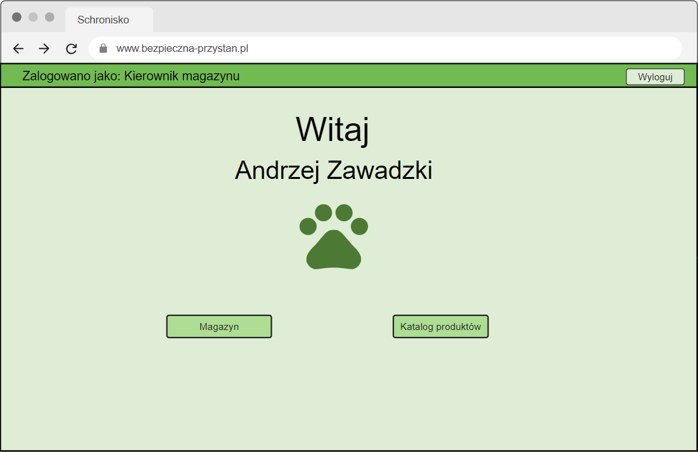
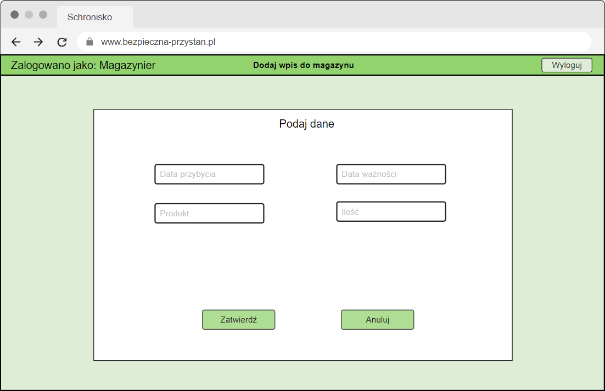

# Zadanie 7
## Schemat projektowania interfejsu - aspekt UX

**Typ interfejsu:** Aplikacja WWW

**Wymagania urządzenia:** {PC, monitor, mysz, klawiatura} lub laptop, dostęp do Internetu

### Szablon interfejsu i ekran logowania

### Typowe zadania użytkowników

#### Grupa kierownicy

1-kierownik: 5 kwietnia 2022 r. do schroniska został zatrudniony nowy lekarz weterynarii Jan Kowalski. Po zebraniu danych nowego pracownika (nr dowodu: C76823, adres: ul. Letnia 5,  70-445 Łódź, email: jkowalski@gmail.com, nr telefonu: 500 234 123) kierownik Agata Szpak (nr pracownika: 5) dodaje pracownika do ewidencji schroniska.
   
#### Grupa pracownicy biurowi

1-pracownik biurowy: Jakiś czas temu do schroniska trafił nowy pies. Pracownik biurowy Maria Luba (id pracownika: 12) otrzymuje od opiekuna psa Marka Złotnickiego karteczkę z informacjami o nowym psie: imię: Giuseppe, płeć: samiec, rasa: corgi, waga: 22kg, data przyjęcia do schroniska: 16.12.22r., nr boksu: 24, opis: brak ogonka. Pracownica biurowa wpisuje psa do ewidencji.

2-pracownik biurowy: W schronisku znajduje się pies rasy husky syberyjski o imieniu Loki (nr ewidencji: 192). Pracownik biurowy Joanna Kłos (id pracownika: 15) sfinalizowała adopcje z panem Witoldem Czopem, który odbył już 3 wizyty przed-adopcyjne  z Lokim i był zdecydowany na adopcję. Finalizacja nastąpiła 12.06.2022  r. Teraz pani Joanna dodaje nowy wpis adopcyjny o zakończonej adopcji i zmienia status Lokiego na zaadoptowany. Z kopii umowy adopcyjnej ma niezbędne dane pana Czopa, adres: ul. Północna 102, 81-029 Gdynia, nr telefonu 783 682 678 oraz nr dokumentu potwierdzającego tożsamość: ABC 1 23456.
   
#### Grupa weterynarze

1-weterynarz: 20 maja 2022 r. po wykonaniu zabiegów szczepienia na wściekliznę, czipowania i sterylizacji suczki Kiry (nr ewidencyjny: 202), weterynarz Jan Kowalski (id pracownika: 2) rejestruje wykonane czynności w karcie zdrowia zwierzęcia oraz dodaje nowy numer czipa (91230000000) do profilu Kiry w ewidencji schroniska.
   
#### Grupa behawioryści

1-behawiorysta: Behawiorysta Jan Marek (id pracownika: 34) 13.11.2022 r. przeprowadził terapię behawioralną psa Rastra (nr ewidencji: 100), który miał problem z socjalizacją z innymi psami. Uzupełnia książeczkę zdrowia psa o wykonaną usługę, a w opisie wpisuje postęp psa.
   
#### Grupa kierownicy magazynu

1-kierownik magazynu: Do schroniska przybyła nowa dostawa suchej karmy dla seniorów firmy VetPro, której nie ma jeszcze w katalogu produktów. Karma jest zapakowana w workach po 15kg. Kierownik magazynu Adam Małysz (id pracownika: 20) dodaje karmę do katalogu produktów.
   
#### Grupa magazynierzy

1-magazynier:  Do schroniska 15 czerwca 2022 przybyła nowa dostawa suchej karmy dla seniorów firmy VetPro (id produktu: 15). Po sprawdzeniu dat ważności każdego opakowania, magazynier Tomasz Kot (id pracownika: 23) wpisuje do magazynu, że 12 opakowań ma datę ważności 27 listopada 2023 r., a pozostałe 8 opakowań 5 grudnia 2023 r.
   

### Scenariusze do zadań użytkowników
#### Grupa kierownicy
**Ustalenia:** kierownik jest zalogowany
1.  Kierownik wybiera zakładkę “Pracownicy”

3.  System wyświetla ekran “Pracownicy”

5.  Kierownik wybiera opcję “Dodaj nowego pracownika"
6.  System wyświetla ekran z formularzem do wypełnienia

8.  Kierownik wpisuje wszystkie posiadane informacje nt. pracownika
9.  Kierownik zatwierdza dodanie nowego pracownika
10.  System wyświetla profil nowo dodanego pracownika

   

#### Grupa pracownicy biurowi
**Ustalenia:** pracownik biurowy jest zalogowany.  
Zadanie 1:
1.  Pracownik biurowy wybiera zakładkę  “Psy”

3.  System wyświetla ekran “Psy”

5.  Pracownik biurowy wybiera opcję “Dodaj nowego psa”
6.  System wyświetla ekran z formularzem do wypełnienia

8.  Pracownik biurowy wpisuje wszystkie posiadane informacje nt. psa w odpowiednich polach: imię: Giuseppe, płeć: samiec, rasa: corgi, waga: 24kg, data przyjęcia do schroniska: 16.12.2022, nr boksu: 24, opis: brak ogonka
9.  Pracownik zatwierdza dodanie nowego psa
10.  System wyświetla profil nowo dodanego psa

Zadanie 2:
1.  Pracownik biurowy wybiera zakładkę “Adopcje”

3.  System wyświetla ekran “Adopcje”

4.  Pracownik biurowy wybiera opcję “Dodaj nowy wpis”
5.  System wyświetla ekran z dodania nowego wpisu

12.  Pracownik biurowy wpisuje dzień zakończenia adopcji: 12.06.2022r., oraz wyszukuje w polu “Wybierz psa” psa po numerze ewidencyjnym: 192 i adekwatnie w polu “Wybierz adoptującego” wyszukuje adoptującego po jego id: 25
13.  Zatwierdza dodanie nowego wpisu
14.  System wyświetla nowo dodany wpis 

16. Pracownik biurowy wybiera zakładkę  “Psy”

18.  System wyświetla ekran “Psy”

20. Pracownik wyszukuje psa po numerze ewidencyjnym: 192
21. System wyświetla profil wybranego psa

21.  Pracownik biurowy wybiera opcję edycji profilu psa
22.  System wyświetla profil psa w trybie edycji

24. Pracownik biurowy edytuje pole status i zmienia je na "zaadaptowany"
25. Pracownik biurowy zatwierdza wprowadzone zmiany
26. System wyświetla profil psa po wprowadzonych zmianach

   

#### Grupa weterynarze
**Ustalenia:** weterynarz jest zalogowany.
1.  Weterynarz wybiera zakładkę “Psy”

3.  System wyświetla ekran “Psy”

5.  Weterynarz wpisuje nr ewidencyjny psa: 202 w polu wyszukiwania i wybiera opcję wyszukaj
6.  System wyświetla profil wybranego psa

8.  Weterynarz wybiera opcję edytuj profil psa
9.  System wyświetla profil psa w trybie edycji

11.  W polu “nr chipa” weterynarz wpisuje: “91230000000”
12.  Weterynarz zatwierdza zmiany
13.  System wraca do wyświetlania profilu wybranego psa

15.  Weterynarz wybiera opcję “Książeczka zdrowia”
16.  System wyświetla książeczkę zdrowia wybranego psa

18.  Weterynarz wybiera opcję “Zarejestruj nową czynność”
12.  System wyświetla formularz dodania nowego wpisu do książeczki zdrowia

20.  Zaznacza rodzaj “Szczepienie” i wpisuje szczegóły w odpowiednich polach, np. [data] = 20.05.2022
21.  Potwierdza dodanie nowego wpisu do książeczki zdrowia
22.  System wyświetla podglą nowo dodanego wpisu

24.  Powtarzana kroki: 10-15 – dla zabiegu sterylizacji
   

#### Grupa behawioryści
**Ustalenia:** behawiorysta jest zalogowany.
1.  Behawiorysta wybiera zakładkę “Psy”

3.  System wyświetla ekran “Psy”

5.  Behawiorysta wpisuje nr ewidencyjny psa: 100 w polu wyszukiwania i wybiera opcję wyszukaj
6.  System wyświetla profil wybranego psa

8.  Weterynarz wybiera opcję “Książeczka zdrowia”
9.  System wyświetla książeczkę zdrowia wybranego psa

11.  Behawiorysta wybiera opcję “Zarejestruj nową czynność”
12.  System wyświetla formularz dodania nowego wpisu do książeczki zdrowia

14.  Zaznacza rodzaj “Terapia behawioralna” i wpisuje datę: “13.11.2022” oraz opis przeprowadzonej terapii
15.  Behawiorysta potwierdza dodanie nowego wpisu do książeczki zdrowia
22.  System wyświetla podglą nowo dodanego wpisu

   

#### Grupa kierownicy magazynu
**Ustalenia:** kierownik magazynu jest zalogowany
1.  Kierownik magazynu wybiera zakładkę “Katalog produktów”

3.  System wyświetla ekran “Katalog produktów”

5.  Kierownik magazynu wybiera opcje “Dodaj nowy produkt”
6.  System wyświetla ekran dodawania nowego produktu

8.  Kierownik magazynu wpisuje wszystkie informacje o produkcie tj. nazwa, producent, waga, rodzaj, kategoria
9.  Kierownik magazynu potwierdza dodanie nowego produktu
10.  System wyświetla dane nowo dodanego produktu

   

#### Grupa magazynierzy
**Ustalenia:** magazynier jest zalogowany
1.  Magazynier wybiera zakładkę “Magazyn”.

3.  System wyświetla ekran “Magazyn”

5.  Magazynier wybiera opcje “Dodaj nowy wpis”
6.  System wyświetla ekran dodania nowego wpisu do magazynu

8.  Magazynier wybiera produkt (id produktu: 15) i wpisuje  dane: “Data przybycia=15.06.2022”,  “Data ważności = 27.11.23”, “Ilość = 12”
9.  Magazynier potwierdza dodanie nowego wpisu
10.  System wyświetla nowo dodany wpis

12.  Magazynier powtarza kroki 1-6 i wpisuje dane: “Data przybycia=15.06.2022”, “Data ważności = 05.12.23”, “Ilość = 8”
